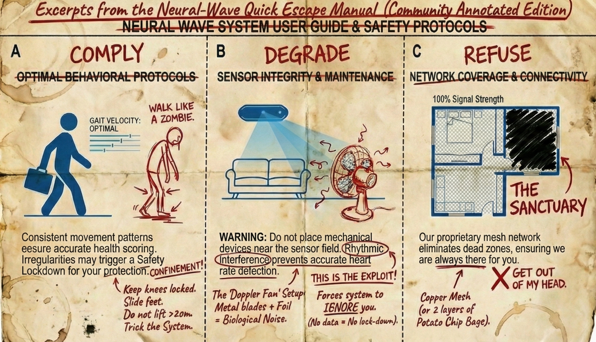
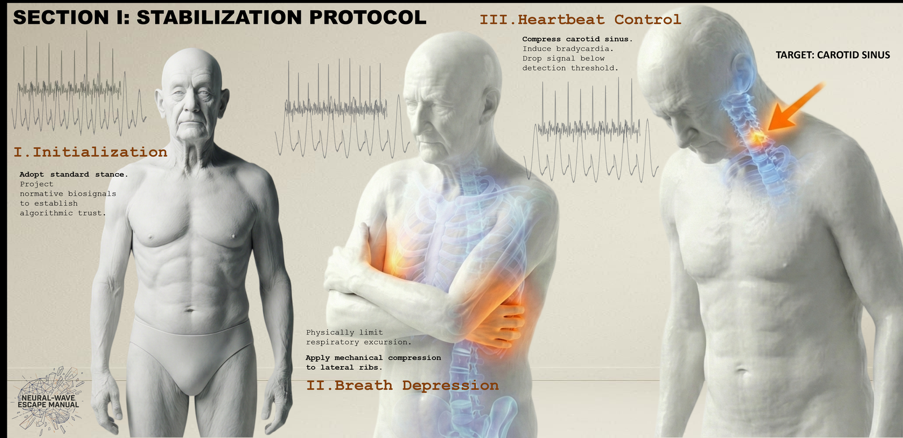
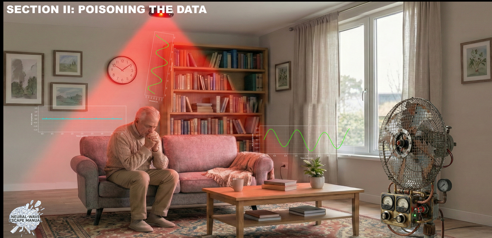
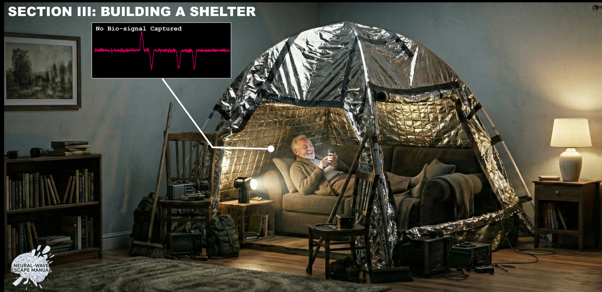

# NEURAL-WAVE — Quick Escape Manual 2036

> **Archive Access Granted.**
>
> A design-fiction field guide to adversarial living in the era of **"Empathic" AIoT**.

[Read the Manual](manual/Neural-Wave_Quick_Escape_Manual_2036.pdf) · [Paper](paper/neural_wave_quick_escape_manual_2036_preprint.pdf) · [Explore the Archive](archive/) · [Cite](#citation)

---

## What is Neural-Wave 2036?

By 2036, population aging is no longer a demographic curve — it is an operational mandate. Under chronic shortages of care labor, "care" is recast as an auditable public obligation, and the home is reclassified as a sensing endpoint. `Neural-Wave` is the "empathic" AIoT platform procured at scale for this mandate: a *camera-free* millimeter-wave (mmWave) radar system that infers well-being from involuntary micro-motions, outputting spectrograms and risk scores instead of footage.

"Camera-free" never means governance-free. What changes is the resident's capacity to notice and contest what is happening. The conflict shifts from *"I am being watched"* to *"I am being inferred"* — and opt-out becomes *"This feature is unavailable for your safety."*

This archive presents a provocative design-fiction research artifact: **The Neural-Wave Quick Escape Manual**, an "authorized" troubleshooting document that renders refusal actionable through three pathways — **Comply**, **Degrade**, **Refuse**. Through it, we argue that in the era of empathic AIoT, privacy requires more than policy opt-outs; it demands *adversarial literacy* — the capacity to meaningfully obfuscate one's own data traces against an infrastructural jailer that calls itself care.

## Start Here

- **Quick Escape Manual** — the core diegetic artifact · [PDF](manual/Neural-Wave_Quick_Escape_Manual_2036.pdf)
- **Research paper / preprint** · [PDF](paper/neural_wave_quick_escape_manual_2036_preprint.pdf) · [BibTeX](paper/citation.bib)
- **2036 timeline** · [archive/timeline_2036.md](archive/timeline_2036.md)
- **Glossary** · [archive/glossary.md](archive/glossary.md)
- **Empathic AIoT setting** · [archive/empathic_aiot.md](archive/empathic_aiot.md)
- **Threat model** · [archive/threat_model.md](archive/threat_model.md)
- **Scenario cards** · [archive/scenario_cards.md](archive/scenario_cards.md)
- **Design rationale** · [archive/design_rationale.md](archive/design_rationale.md)

## Archive

The 2036 world in five images.


**Figure 2 · The Ontological Gap.** Arthur's joy is algorithmically misdiagnosed as "Pre-Stroke Agitation."


**Figure 3 · Tactic 01: Bio-Obedience.** The user performs the "Statue Protocol," suppressing vital signs to appease the algorithm.


**Figure 4 · Tactic 02: The Phantom.** A modified oscillator mimics a "Hyper-Normal" sinus rhythm, rendering the chaotic human body invisible.


**Figure 5 · Tactic 03: The Null Space.** Aluminum shielding creates a "data void" in the millimeter-wave field.

## Research Context

This is an accepted design-fiction paper for **ACM Interactions** (2026). It contributes a diegetic prototype — the Escape Manual — as a *research-through-design* argument: when governance becomes infrastructural, resistance must become technical. For a deeper statement of method and a discussion of the "Accuracy Trap," *Performative Wellness*, and *Adversarial Literacy*, see [paper/](paper/).

## Citation

To cite the paper:

```bibtex
@misc{gu2026neuralwave,
  title     = {The Neural-Wave Quick Escape Manual 2036: A Field Guide to
               Adversarial Living in the Era of "Empathic" AIoT},
  author    = {Gu, Boyuan and Cheng, Shuaiqi and Yu, Minghao},
  year      = {2026},
  note      = {Design fiction, accepted for publication in ACM Interactions},
  url       = {https://github.com/phish-tech/Neural-Wave-2036}
}
```

To cite the archive/repository, use the `CITATION.cff` entry — GitHub renders a **Cite this repository** button in the sidebar.

## License

This repository is dual-licensed:

| What | License |
| ---- | ------- |
| Code and web assets | [MIT](LICENSE-CODE) |
| Original text, manual, figures, and visual assets | [CC BY 4.0](LICENSE-CONTENT) |
| Third-party assets | See [visuals/ASSET_LICENSES.md](visuals/ASSET_LICENSES.md) |

**This is a design-fiction / research artifact. It is not a product manual, safety document, or technical guide.** It does not contain device specifications, frequencies, or reproducible interference methods, and must not be used to defeat real monitoring systems.

## Maintainers

- **Boyuan Gu** (correspondence) — guboyuan79@gmail.com
- **Shuaiqi Cheng**
- **Minghao Yu**

University of Electronic Science and Technology of China (UESTC).

---

*This repository is an open design-fiction archive — a complete, citable, and continuously maintained speculative research artifact, not a forgotten preprint.*
